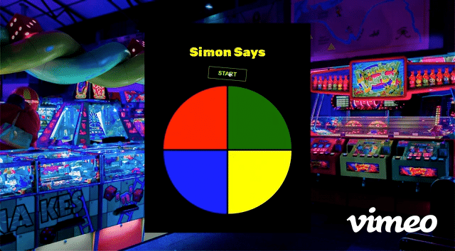

Final Capstone (Simon Says)

You've been hired as an intern at *Thinkful Game Studio*, which has decided to create a game, *Simon Says*. You will be applying all the HTML, CSS, and JavaScript skills you've learned in this course to help them build this game.

*Simon Says* is a game that displays a series of tones and lights in random order and requires a player repeat the sequence from memory. The game typically displays four colored pads. Each pad produces a particular tone when it is pressed. The tone helps the player in remembering the sequence. With each additional round, the number of pads in the sequence increases by one. Once the player makes a mistake, the game ends and resets.

You will build a web-based *Simon Says* game that you can play solo. The game designers have provided the source code that needs to be completed. You are encouraged to come up with an original visual design for this game or even change the theme. 

